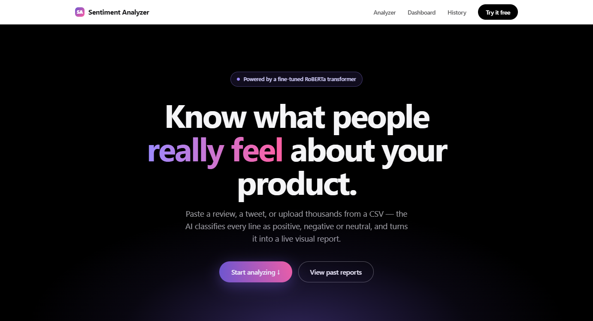
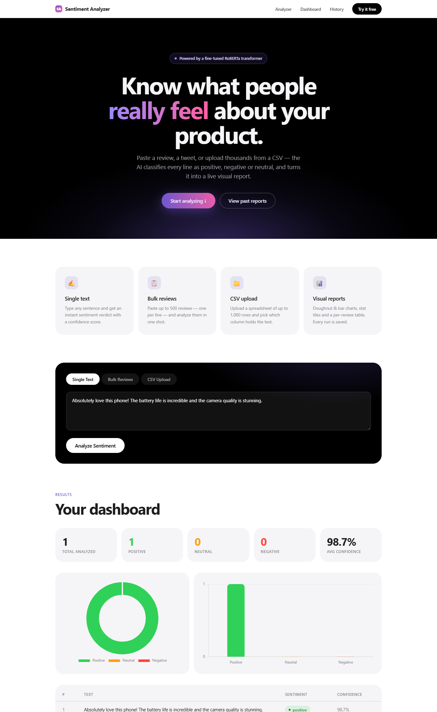
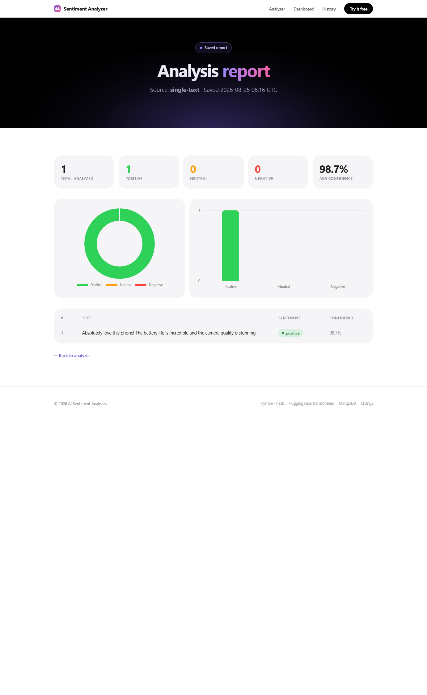

# 🧠 AI-Based Sentiment Analyzer


> Analyze product reviews, tweets, feedback & social-media posts and classify them as **Positive 😊**, **Negative 😠**, or **Neutral 😐** — powered by a state-of-the-art Hugging Face Transformer, with a live visual dashboard and saved analysis history.

---

## ✨ Features

| | Feature | Details |
|---|---|---|
| 🔤 | **Single Text Analysis** | Type any sentence/review and instantly get its sentiment + confidence score |
| 📋 | **Bulk Paste Mode** | Paste up to **500 lines** (one review per line) and analyze them all at once |
| 📄 | **CSV Upload** | Upload a `.csv` (max 5 MB), choose the text column, analyze up to **1,000 rows** |
| 📊 | **Interactive Dashboard** | Live doughnut + bar charts (Chart.js), stat tiles (total / positive / negative / neutral / avg confidence) and a per-row result table |
| 🕘 | **Analysis History** | Every analysis is persisted with a unique ID and re-viewable anytime at `/history/<id>` |
| 💾 | **Smart Storage** | Uses **MongoDB** when available, and **automatically falls back to a local JSON file** if Mongo is down — zero-config demos |
| ⚡ | **Batched Inference** | Transformer inference is batched (batch size 16) for fast bulk scoring |

---

## 📸 Screenshots

### 🏠 Analyzer — Single Text Mode


### 📊 Live Dashboard — Charts, Stats & Results


### 🕘 Saved Analysis Report (`/history/<id>`)


---

## 🛠️ Tech Stack

| Layer | Technology |
|---|---|
| NLP Model | [`cardiffnlp/twitter-roberta-base-sentiment-latest`](https://huggingface.co/cardiffnlp/twitter-roberta-base-sentiment-latest) — 3-class RoBERTa (via Hugging Face Transformers + PyTorch) |
| Backend | Python **Flask** |
| Database | **MongoDB** (PyMongo) with automatic JSON-file fallback |
| Frontend | HTML5 / CSS3 / Vanilla JS + **Chart.js** |

---

## 🧭 How It Works

```
                        ┌──────────────────────────────────────────┐
   Browser ──POST──────▶│                Flask App                 │
  (single / bulk / CSV) │  app.py  ── routes, validation, summary  │
                        │     │                                    │
                        │     ▼                                    │
                        │  sentiment.py                            │
                        │  RoBERTa tokenizer → model → softmax     │
                        │  → label (pos/neg/neu) + confidence      │
                        │     │                                    │
                        │     ▼                                    │
                        │  storage.py                              │
                        │  MongoDB ✓ ──else──▶ data/analyses.json  │
                        └──────────────┬───────────────────────────┘
                                       ▼
                          Dashboard (Chart.js) + History pages
```

1. **Input** arrives as a single text, multi-line paste, or CSV column.
2. Texts are truncated to 512 chars, tokenized, and scored in batches of 16.
3. Softmax probabilities produce a label (`positive` / `negative` / `neutral`) and a confidence value.
4. Results are summarized (counts + average confidence) and **saved to storage**.
5. The dashboard renders charts + tables; each run gets a shareable `/history/<id>` link.

---

## 📁 Project Structure

```
analyzer/
├── app.py               # Flask routes: single / bulk / CSV analysis + history views
├── sentiment.py         # Hugging Face Transformer engine (lazy-loaded, batched inference)
├── storage.py           # MongoDB layer with automatic JSON-file fallback
├── config.py            # Env-driven configuration (Mongo URI, model name, limits)
├── requirements.txt     # Python dependencies
├── sample_reviews.csv   # Demo dataset — try the CSV upload with this!
├── docs/                # Screenshots (used in this README)
│   ├── 01_home.png
│   ├── 02_dashboard.png
│   └── 03_history_report.png
├── templates/
│   ├── base.html        # Layout shell (navbar, footer)
│   ├── index.html       # Analyzer form + live dashboard + history list
│   └── report.html      # Saved-analysis detail page (/history/<id>)
└── static/
    ├── style.css        # UI styling
    └── main.js          # Form handling, fetch calls, Chart.js rendering
```

---

## 🚀 Getting Started

### Prerequisites
- **Python 3.9+**
- **MongoDB** *(optional)* — the app runs perfectly without it using the JSON fallback
- ~600 MB free disk space (first run downloads the transformer model)

### Installation

```bash
# 1. Clone the repository
git clone https://github.com/divyanshusrivastava2k3/sentiment-analyzer.git
cd sentiment-analyzer

# 2. Create & activate a virtual environment
python -m venv .venv
.\.venv\Scripts\activate          # Windows
# source .venv/bin/activate       # macOS / Linux

# 3. Install dependencies
pip install -r requirements.txt

# 4. (Optional) Start MongoDB
net start MongoDB                 # Windows service
# mongod --dbpath .\data\db       # manual start

# 5. Run the app
python app.py
```

Open **http://localhost:5000** in your browser. 🎉

> ⏳ **First run** downloads the RoBERTa model (~500 MB) from the Hugging Face Hub.
> Subsequent runs load it instantly from cache.

---

## ⚙️ Configuration

All settings are environment-variable driven (see `config.py`):

| Variable | Default | Purpose |
|---|---|---|
| `MONGO_URI` | `mongodb://localhost:27017` | MongoDB connection string |
| `MONGO_DB` | `sentiment_analyzer` | Database name |
| `SENTIMENT_MODEL` | `cardiffnlp/twitter-roberta-base-sentiment-latest` | Any HF sentiment model |
| `SECRET_KEY` | `dev-secret-key-change-me` | Flask secret key (set in production!) |

---

## 🖥️ Usage Guide

1. **Single Text** — type/paste a review, click *Analyze* → see label + confidence.
2. **Bulk Paste** — one review per line (≤ 500 lines) → full summary + table.
3. **CSV Upload** — pick your file, optionally type the column containing text (defaults to first column), upload (≤ 1,000 rows).
4. **Dashboard** — doughnut chart (label split), bar chart (distribution), stat tiles, avg confidence, and a sortable result table.
5. **History** — every run appears on the home page; open any past run via `/history/<id>`.

💡 **Try it now:** upload `sample_reviews.csv` from the repo root to see the full pipeline in action.

---

## 🔌 API Reference

### `POST /analyze` — single text
```bash
curl -X POST http://localhost:5000/analyze -d "text=I love this product!"
```

### `POST /analyze-bulk` — multi-line batch
```bash
curl -X POST http://localhost:5000/analyze-bulk \
     --data-urlencode $'texts=Great product!\nTerrible quality.\nIt is okay.'
```

### `POST /analyze-csv` — multipart file upload
```bash
curl -X POST http://localhost:5000/analyze-csv \
     -F "file=@sample_reviews.csv" \
     -F "column=review_text"
```

### `GET /history/<analysis_id>` — view a saved analysis

**Sample JSON response**
```json
{
  "summary": {
    "total": 3,
    "positive": 2,
    "negative": 1,
    "neutral": 0,
    "avg_confidence": 0.9412
  },
  "results": [
    { "text": "Great product!", "label": "positive", "confidence": 0.9871 },
    { "text": "Terrible quality.", "label": "negative", "confidence": 0.9534 },
    { "text": "It is okay.", "label": "neutral", "confidence": 0.8831 }
  ],
  "id": "66c9f0e2a1b2c3d4e5f60718"
}
```

---

## 🧠 About the Model

[`cardiffnlp/twitter-roberta-base-sentiment-latest`](https://huggingface.co/cardiffnlp/twitter-roberta-base-sentiment-latest) is a RoBERTa-base model fine-tuned on ~124 M tweets (~58 M for fine-tuning) for 3-class sentiment classification. It's robust on informal, short-form text — ideal for reviews, tweets, and comments.

---

## 🩺 Troubleshooting

| Problem | Fix |
|---|---|
| `torch` install fails on Windows | Use Python 3.9–3.12 and `pip install torch --index-url https://download.pytorch.org/whl/cpu` for the CPU wheel |
| Slow first request | Normal — the model downloads once (~500 MB); later runs load from cache |
| `MongoClient` errors in console | MongoDB isn't running — app auto-switches to `data/analyses.json`; install/start Mongo to enable DB mode |
| Port 5000 already in use | Change the port at the bottom of `app.py` |
| CSV shows wrong column analyzed | Enter the exact header name of your text column in the *Column* field |

---

## 🗺️ Roadmap

- [ ] Export results as CSV / Excel
- [ ] Per-text confidence heatmap in bulk mode
- [ ] Dockerfile + docker-compose (app + MongoDB)
- [ ] REST auth (API keys) for programmatic access
- [ ] Multi-model selector (DistilBERT, multilingual models)

---

## 🤝 Contributing

Pull requests are welcome! For major changes, please open an issue first to discuss what you'd like to change.

1. Fork the repo
2. Create your branch: `git checkout -b feature/amazing-feature`
3. Commit: `git commit -m "Add amazing feature"`
4. Push: `git push origin feature/amazing-feature`
5. Open a Pull Request

---

## 📄 License

This project is open source and available under the [MIT License](LICENSE).

---

<p align="center">Made with ❤️, Flask & Transformers</p>
